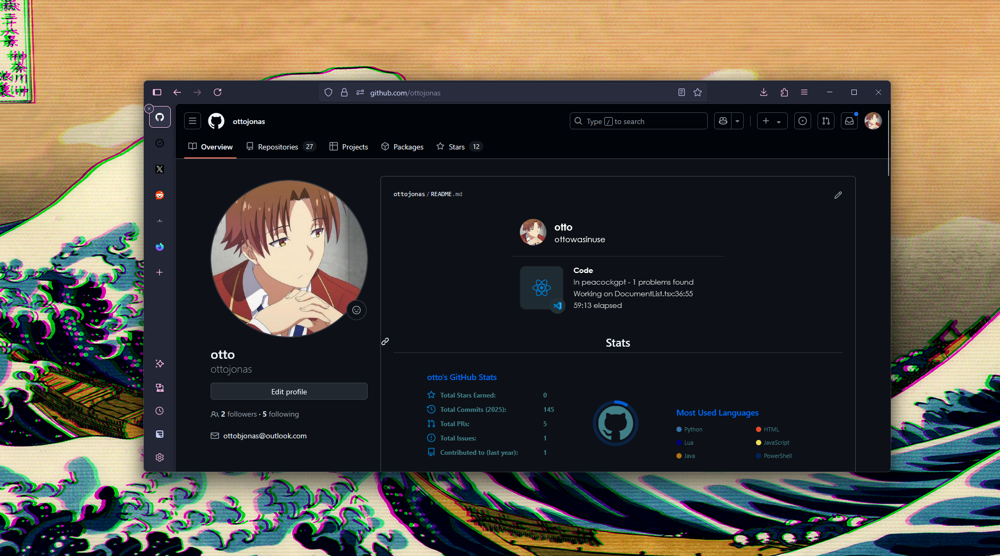
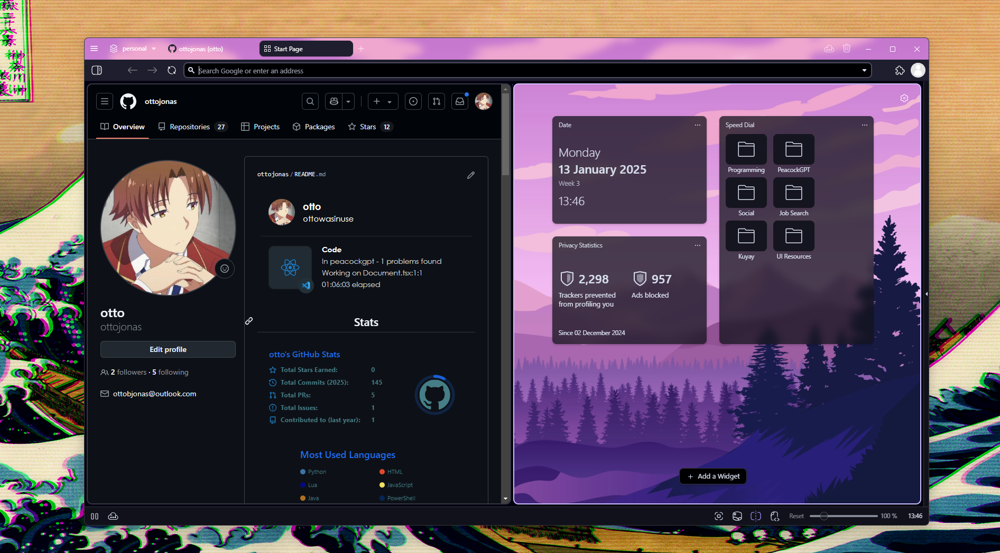
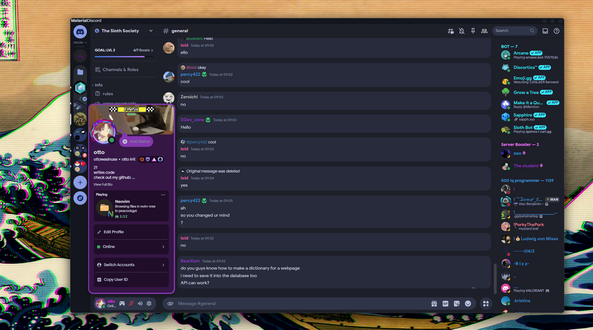

    <h1>What I Use</h1>

    <h2><a href = "https://github.com/ottojonas/config-and-equipment/tree/main/software-configs">Software</a></h2>

    <h2>Windows</h2>

    <h3>Personal</h3>

    <h3>Work</h3>

<h3>Browser(s)</h3>

<h4><a href = "https://www.mozilla.org/en-GB/firefox/channel/desktop/#nightly">Firefox Nightly</a></h4>

<h4><a href = "https://vivaldi.com/download/">Vivaldi</a></h4>

<h3>IDE's</h3>
<h4><a href = "https://github.com/ottojonas/config-and-equipment/tree/main/software-configs/work-windows-software-config/configs/visual-studio-code">Visual Studio Code</a></h4>

<h3>Terminal</h3>
<h4><a href ="https://github.com/ottojonas/config-and-equipment/tree/main/software-configs/work-windows-software-config/configs/windows-terminal">Windows Terminal</a></h4>

<h3>Other</h3>
<h4><a href = "https://betterdiscord.app/">Better Discord (Material Discord Theme)</a></h4>

    <h2>Linux</h2>

    <h3>Personal</h3>

    <h3>Work</h3>

    <h2><a href = "https://github.com/ottojonas/config-and-equipment/tree/main/hardware">Hardware</a></h2>

    <h2>Windows</h2>

    <h3>Personal</h3>

    <h3>Work</h3>

    <h2>Linux</h2>

    <h3>Personal</h3>

<h3>Browser(s)</h3>
<h4><a href = "https://www.mozilla.org/en-GB/firefox/channel/desktop/#nightly">Firefox Nightly</a></h4>
<h4><a href = "https://vivaldi.com/download/">Vivaldi</a></h4>

<h3>IDE's</h3>

<h4><a href ="https://github.com/ottojonas/config-and-equipment/tree/main/software-configs/personal-linux-software-config/configs/nvim">NeoVim</a></h4>

<h3>Terminal</h3>
<h4><a href = "">Kitty</a></h4>

    <h3>Work</h3>

