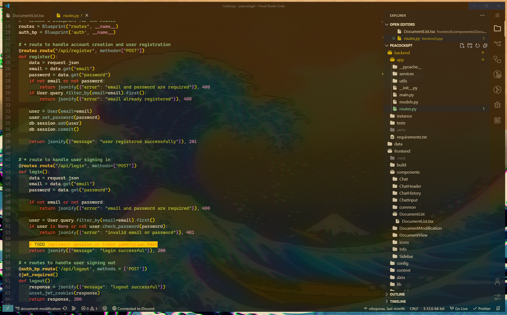
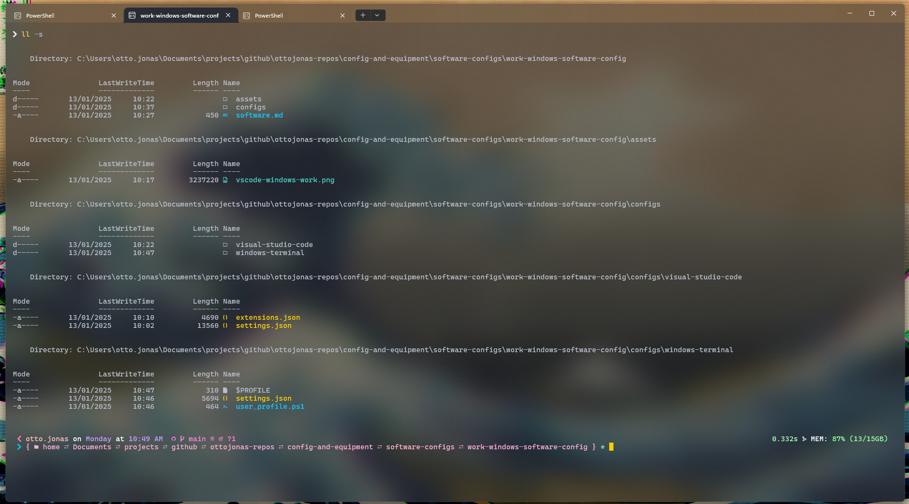

    <h1>What I Use</h1>

    <h2><a href = "https://github.com/ottojonas/config-and-equipment/tree/main/software-configs">Software</a></h2>

    <h2>Windows</h2>

    <h3>Personal</h3>

    <h3>Work</h3>

<h3>IDE's</h3>
<h4><a href = "https://github.com/ottojonas/config-and-equipment/tree/main/software-configs/work-windows-software-config/configs/visual-studio-code">Visual Studio Code</a></h4>

<h3>Terminal</h3>
<h4><a href ="https://github.com/ottojonas/config-and-equipment/tree/main/software-configs/work-windows-software-config/configs/windows-terminal">Windows Terminal</a></h4>

    <h2>Linux</h2>

    <h3>Personal</h3>

    <h3>Work</h3>

    <h2><a href = "https://github.com/ottojonas/config-and-equipment/tree/main/hardware">Hardware</a></h2>

    <h2>Windows</h2>

    <h3>Personal</h3>

    <h3>Work</h3>

    <h2>Linux</h2>

    <h3>Personal</h3>

    <h3>Work</h3>

